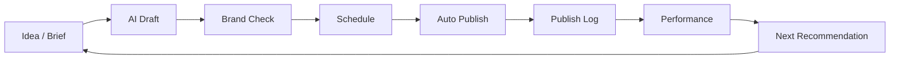

# Research Report: 1PM Marketing Admin Core Functions Audit

Conducted: 2026-06-06  
Scope: personal-use first, public customer SaaS later  
Product reviewed: 1PM Marketing Command Center in `/Users/phamngocdan/Downloads/SYSTEM D-1PM`

## Executive Summary

Current app direction is broadly right: Overview, Content Studio, Calendar, AI Generator, Campaigns, Analytics, Brand Assets, Social Posting, Local Marketing, Settings. This matches the common category map used by HubSpot, Sprout Social, Hootsuite, and Buffer: planning, publishing, analytics, workflow, AI assist, and asset management.

But for real use, the current product is too wide and not deep enough. The highest-value missing core is not another dashboard page. It is the operating loop: connect channel -> create/schedule -> approve -> publish -> capture result -> recommend next action. Without this loop, Overview/Analytics/Campaign ROI stay decorative.

Recommendation: keep the current 10-screen shell, but prioritize 6 real workflows for personal v1. Hide or soften modules that imply capabilities not implemented yet. Do not build public SaaS features until personal workflow is reliable.

## Research Methodology

- Sources consulted: 12 web sources plus codebase scan.
- Date range: 2025-2026 materials prioritized.
- Key terms: social media management features, publishing workflow, AI marketing hub, content calendar, social listening, Meta publishing API, social media trends 2026.

## Current App Inventory

### Already Reasonable

- Overview command center.
- Content Studio with kanban workflow.
- Content Calendar.
- AI Generator mock surface.
- Campaign management table/detail.
- Analytics dashboard.
- Brand Assets library.
- Social Posting composer/queue/approvals.
- Local Marketing page.
- Settings workspace/team/integrations.
- Action workflow modal for create/edit/duplicate/approve.

### Product Truth

The UI looks like an all-in-one marketing OS. The backend currently supports basic CRUD/resources and JSON state. So the next work should narrow from "many screens" to "few complete workflows."

## Market Pattern

### Competitor Core Modules

HubSpot Marketing Hub emphasizes CRM-connected campaigns, AI, email nurturing, high-intent leads, social agent, and marketing analytics. Source: [HubSpot Marketing Hub](https://www.hubspot.com/products/marketing?web=1)

Sprout Social's core spread is publishing, workflow, engagement/customer care, reporting, analytics, listening, advocacy, and optimal-time recommendations. Sources: [Sprout Features](https://sproutsocial.com/features/), [Sprout Reporting](https://sproutsocial.com/features/social-media-reporting/)

Hootsuite positions around planning/posting, engaging, listening, analytics/reporting, inbox, auto-responder, tagging, assignments, integrations, bulk scheduling, AI writing, Canva templates, link tracking. Source: [Hootsuite Solutions](https://www.hootsuite.com/solutions)

Buffer is simpler: channels, scheduling, content visualization, AI assistant, analytics, engagement tracking. Source: [Buffer review summary](https://www.techradar.com/reviews/buffer)

2026 trend reports point to fast-response content, ROI from creator/advocacy, AI-assisted social listening, human creativity, and recommended timing/format optimization. Sources: [Hootsuite Social Trends 2026](https://www.hootsuite.com/research/social-trends/marketing), [Sprout Best Times 2026](https://sproutsocial.com/insights/best-times-to-post-on-social-media/?survey=123), [Buffer Engagement 2026](https://buffer.com/insights/state-of-social-media-engagement-2026/), [CMI B2B Trends 2026](https://contentmarketinginstitute.com/articles/b2b-content-marketing-trends-research/)

### Meta/Facebook Reality

For auto-posting, Meta publishing is possible but operationally annoying. Facebook Page publishing needs Page tokens and permissions such as `pages_manage_posts`; Instagram publishing requires a business/creator account connected to a Facebook Page. App Review/Business Verification becomes important when going public. Sources: [Facebook API Posting Guide](https://postproxy.dev/blog/facebook-api-posting-integration-guide/), [Facebook Graph API Posting Guide](https://postproxy.dev/blog/facebook-graph-api-posting-guide/), [Meta Instagram Postman docs](https://www.postman.com/meta/workspace/instagram/documentation/23987686-9386f468-7714-490f-9bfc-9442db5c8f00)

## Verdict By Module

| Module | Keep? | v1 Personal Verdict | Public Later Verdict |
|---|---:|---|---|
| Overview | Keep | Must show real operational status, not vanity metrics | Add tenant/client rollups |
| Content Studio | Keep | Core. Make it the main workspace | Add approval roles/client comments |
| Content Calendar | Keep | Core. Needs real schedule/publish state | Add shared calendar and timezone |
| Social Posting | Keep | Highest priority. Connect Page + publish | Multi-channel OAuth and app review |
| AI Generator | Keep but narrow | Draft/caption assistant only | Brand-trained AI, performance learning |
| Campaigns | Keep | Track campaigns manually + link posts | Pull ad/campaign data from APIs |
| Analytics | Keep but honest | Show only data we actually capture | Cross-channel attribution/UTM |
| Brand Assets | Keep light | Useful for brand voice, templates, media | Asset approval/versioning |
| Local Marketing | Defer/hide | Not core unless local-business customer | Google Business Profile integration |
| Settings | Keep | Admin/profile/integrations | Billing/team/RBAC/security |

## What To Add

### P0: Needed Before Personal Use Feels Real

1. Social Channel Connections
   - Connect Facebook Page first.
   - Store Page ID, Page name, token expiry/status, permissions.
   - Show "Connected / Needs Reconnect / Permission Missing".

2. Real Scheduler + Publisher
   - Scheduled posts should publish at time.
   - States: draft, scheduled, publishing, published, failed, cancelled.
   - Retry failed publish with visible error.

3. Publish Log
   - Every post needs history: created, edited, approved, scheduled, published, failed.
   - This is more valuable than generic analytics early.

4. Media Upload / Asset Attachment
   - Upload image/video.
   - Reuse in Social Posting and Content Studio.
   - Must support at least image posts for Facebook Page.

5. Settings > Integrations Real Screen
   - Facebook Page connect/disconnect.
   - Token health.
   - Test publish or test API connection.

6. Basic Notifications
   - Failed publish.
   - Scheduled post due soon.
   - Approval needed.

### P1: Strong Differentiators

1. Recommended Posting Times
   - Start rule-based.
   - Later use historical engagement.
   - Supported by Sprout/Buffer/Hootsuite market pattern.

2. Content Repurposing
   - One idea -> Facebook caption, Instagram caption, LinkedIn post, short video script.
   - This fits personal operator workflow.

3. Brand Voice Guardrails
   - Store brand tone, banned phrases, CTA style, product facts.
   - AI Generator should use this.

4. UTM / Link Tracking
   - Auto-generate campaign links.
   - Track click intent if integrated later with analytics.

5. Post Performance Feedback Loop
   - Pull or manually enter reach/engagement.
   - Feed best posts back into AI suggestions.

6. Unified Inbox Lite
   - For personal use: comments/mentions only is enough.
   - Full DM/customer care can wait.

### P2: Public SaaS Later

1. Multi-workspace / client accounts.
2. Team roles/RBAC.
3. Client approval portal.
4. Billing/subscription.
5. Audit logs.
6. App Review-ready OAuth for many users.
7. PostgreSQL and background workers.
8. Public API/webhooks.

## What To Remove Or Hide

### Hide In Personal v1

- Local Marketing: keep route but mark as "coming later" unless anh targets local businesses first.
- Advanced Marketing Health score: can mislead if not backed by real signals.
- Generic ROI/ROAS cards: show only after ad/UTM integrations. Before that, label as "manual estimate".

### Do Not Build Now

- Full CRM.
- Email marketing automation.
- Multi-tenant billing.
- Deep social listening.
- Ads creation/optimization.
- Google Business Profile management.
- Employee advocacy.

These are valuable, but too expensive before the core social publishing loop works.

## Recommended Product Shape

### Personal v1 Navigation

1. Dashboard
2. Create
3. Calendar
4. Publish Queue
5. Campaigns
6. Assets
7. Analytics
8. Settings

Current 10 nav items can remain visually, but product focus should be the 8 above. "AI Generator" can be inside Create. "Local Marketing" can be hidden until niche is confirmed.

### Main Workflow

## Brutal Assessment

The UI is ahead of the product engine. That is fine for a demo, but dangerous if sold too early.

Best path: make Facebook Page publishing boringly reliable. Then the app has a real reason to exist. After that, add analytics and AI recommendations. Do not add more dashboards before the system can post, track, and recover from failure.

## Actionable Roadmap

### Next 7 Days

1. Add Integration model: `id`, `provider`, `accountName`, `pageId`, `status`, `permissions`, `connectedAt`.
2. Add Social Post publish states and error message.
3. Add backend scheduler endpoint or worker loop.
4. Add Facebook Page OAuth/connect screen.
5. Add manual "Publish now" for testing.
6. Add publish history log.

### Next 30 Days

1. Add media uploads.
2. Add schedule calendar CRUD.
3. Add AI post variants using brand voice.
4. Add basic analytics from published posts.
5. Add notification center.
6. Backup JSON store.

### Before Public Customers

1. PostgreSQL.
2. Real auth/session.
3. Workspace isolation.
4. App Review/Business Verification.
5. RBAC and audit logs.
6. Billing.
7. Security review.

## Resources & References

- [HubSpot Marketing Hub](https://www.hubspot.com/products/marketing?web=1)
- [Sprout Social Features](https://sproutsocial.com/features/)
- [Sprout Social Reporting](https://sproutsocial.com/features/social-media-reporting/)
- [Hootsuite Solutions](https://www.hootsuite.com/solutions)
- [Hootsuite Social Trends 2026](https://www.hootsuite.com/research/social-trends/marketing)
- [Sprout Best Times to Post 2026](https://sproutsocial.com/insights/best-times-to-post-on-social-media/?survey=123)
- [Buffer State of Social Media Engagement 2026](https://buffer.com/insights/state-of-social-media-engagement-2026/)
- [Content Marketing Institute B2B Trends 2026](https://contentmarketinginstitute.com/articles/b2b-content-marketing-trends-research/)
- [Facebook API Posting Guide](https://postproxy.dev/blog/facebook-api-posting-integration-guide/)
- [Facebook Graph API Posting Guide](https://postproxy.dev/blog/facebook-graph-api-posting-guide/)
- [Meta Instagram Postman Docs](https://www.postman.com/meta/workspace/instagram/documentation/23987686-9386f468-7714-490f-9bfc-9442db5c8f00)

## Unresolved Questions

- Anh muốn app phục vụ chính cho fanpage cá nhân, agency quản lý nhiều khách, hay local business?
- Kênh đầu tiên phải là Facebook Page only, hay Facebook + Instagram cùng lúc?
- Anh ưu tiên auto-publish thật trước hay AI content workflow trước?
